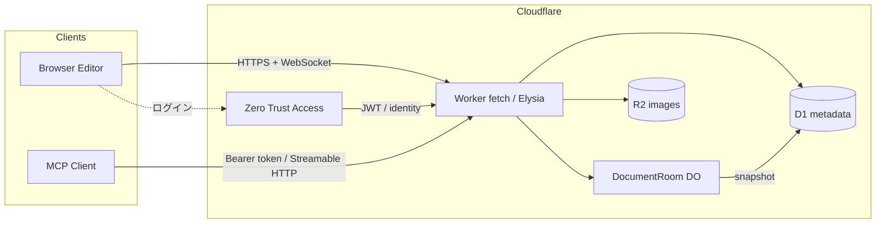
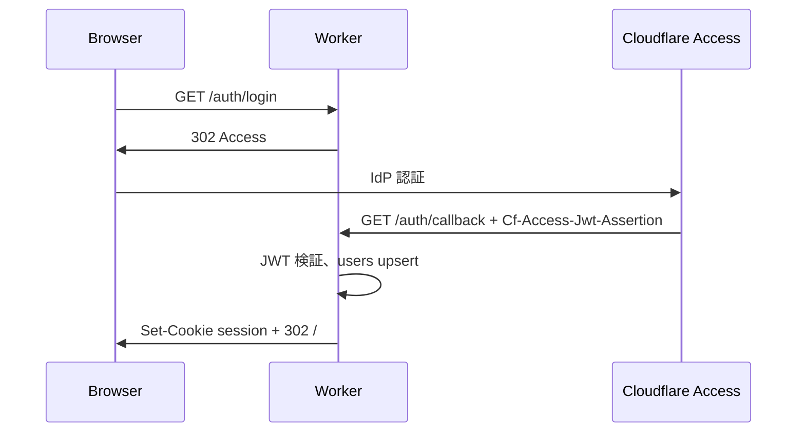
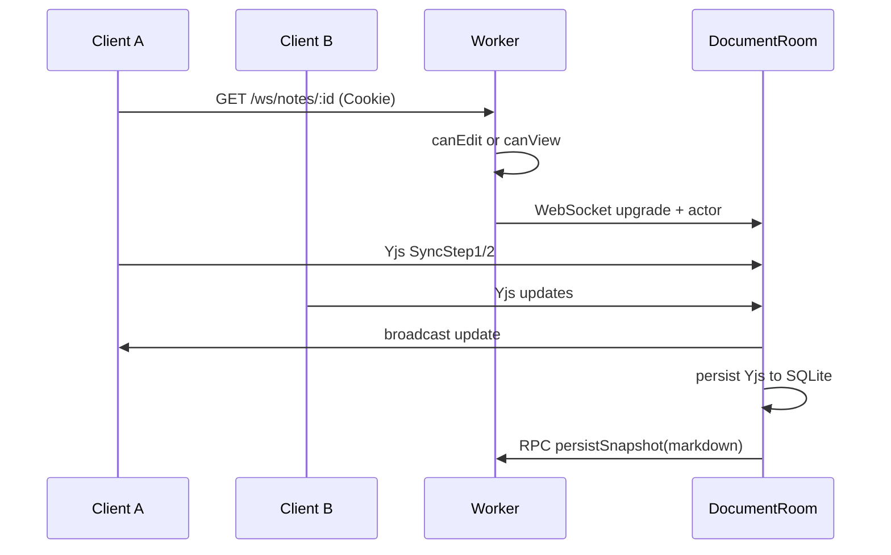

# MiyulabMD 設計書

共同編集できる Markdown エディタ。Cloudflare 上でホストし、CodiMD / HackMD 相当の公開範囲制御と、MCP からのドキュメント編集を提供する。

## 1. 概要

| 項目         | 内容                                                               |
| ------------ | ------------------------------------------------------------------ |
| プロダクト名 | MiyulabMD                                                          |
| 目的         | チーム内外で Markdown を同時編集し、ノート単位で公開範囲を制御する |
| ホスト       | Cloudflare Workers / Durable Objects / D1 / R2 / Access            |
| 編集モデル   | Yjs CRDT（ノートごとに 1 Durable Object）                          |
| 認証         | Cloudflare Zero Trust (Access) によるログイン                      |
| 外部編集     | MCP（Model Context Protocol）                                      |

ブラウザ・MCP クライアントは同じドメインサービスを通す。本文のソース・オブ・トゥルースは Durable Object 上の Yjs ドキュメント、一覧・権限・検索用のメタデータは D1、画像は R2 に置く。

## 2. ゴール / 非ゴール

### ゴール

- 複数人が同じノートを同時編集でき、カーソルと存在（awareness）が見える
- ノートごとに CodiMD 互換の 6 段階公開範囲を設定できる
- Cloudflare Access でログインできる（サイト全体を Access で閉じない）
- 画像のペースト / ドロップを R2 に保存し、ノート権限に従って配信する
- Cursor 等の MCP クライアントからノートの一覧・取得・作成・更新・権限変更ができる
- 単一 Worker で API / WebSocket / 静的配信 / MCP を提供する

### 非ゴール（初期リリース外）

- ノートの版管理 UI・ブランチ・コメントスレッド
- 組織 / チームワークスペース（個人所有 + 招待まで）
- WYSIWYG 編集（初期はソース + プレビュー分割）
- 全文検索エンジン（D1 の LIKE / FTS5 で足りる範囲に留める）
- エンドツーエンド暗号

## 3. 全体アーキテクチャ



| コンポーネント            | 役割                                                                          |
| ------------------------- | ----------------------------------------------------------------------------- |
| `apps/web`                | React フロント。CodeMirror 6 + Yjs、プレビュー、権限 UI                       |
| Worker (`fetch` + Elysia) | 入口は `fetch` 分岐。REST / 認証 / MCP は Elysia。WS と Assets は公式ハンドラ |
| `DocumentRoom` DO         | ノート 1 件につき 1 インスタンス。Yjs 同期・awareness・永続化                 |
| D1                        | ユーザー、ノートメタ、権限、招待、API トークン、Markdown スナップショット     |
| R2                        | 貼付画像                                                                      |
| Access                    | ログイン IdP。公開ノートの閲覧は Worker 側で許可判定する                      |

## 4. 技術選定

| 層         | 選定                                       | 理由                                                                    |
| ---------- | ------------------------------------------ | ----------------------------------------------------------------------- |
| ランタイム | Cloudflare Workers                         | 要件どおり。DO / D1 / R2 / Access と同一基盤                            |
| API        | Elysia (`CloudflareAdapter`)               | 実験用途として採用。スキーマと型推論が強い。Workers 対応は Experimental |
| 共同編集   | Yjs + y-protocols                          | Markdown テキストの CRDT として実績がある                               |
| 同期ハブ   | Durable Objects + WebSocket Hibernation    | ノート単位の一貫性。アイドル時は課金が小さい                            |
| DO 永続化  | DO SQLite                                  | hibernation / 再デプロイ後も Yjs 更新を保持できる                       |
| メタデータ | D1                                         | 権限判定、一覧、MCP の読み取り元                                        |
| 画像       | R2                                         | オブジェクトストレージ。Worker 経由で権限付き配信                       |
| 認証       | Cloudflare Access JWT                      | Zero Trust ログイン。アプリ側セッションに変換する                       |
| フロント   | React + Vite + TypeScript                  | エディタ周辺のエコシステムが広い                                        |
| エディタ   | CodeMirror 6 (`@codemirror/lang-markdown`) | ソース共同編集と Yjs バインディングが明確                               |
| プレビュー | remark / rehype                            | サーバーとクライアントで同じ Markdown パイプラインにできる              |
| MCP        | `agents` の `createMcpHandler`             | MCP 2026-07-28 の stateless Streamable HTTP。DO セッション不要          |
| パッケージ | pnpm workspaces                            | web / worker / shared の型を共有する                                    |

本文の競合解消は CRDT に任せ、OT は採用しない。カーソルは Yjs awareness で同期する。初期は WebRTC は使わない。

Elysia は Bun 向けが本籍で、Workers の `CloudflareAdapter` は公式にも Experimental とある。本リポジトリは実験的プログラムなので、その前提で採用する。既知の制約（Static プラグイン不可、OpenAPI Type Gen 不可、起動前の `Response` 定義不可）は受け入れる。静的配信は Wrangler Assets に任せる。

HTTP の入口はフレームワーク一枚にしない。Worker の `fetch` で経路を分ける。

```ts
export default {
  async fetch(request, env, ctx) {
    const { pathname } = new URL(request.url);
    if (pathname.startsWith("/ws/notes/")) {
      return env.DOCUMENT_ROOM.get(id).fetch(request); // Hibernation は DO
    }
    if (
      pathname.startsWith("/api/") ||
      pathname.startsWith("/auth/") ||
      pathname.startsWith("/mcp")
    ) {
      return api.fetch(request); // Elysia（REST / 認証 / MCP）
    }
    return env.ASSETS.fetch(request);
  },
};
```

Bindings は Elysia ルート内で `import { env } from "cloudflare:workers"` を使う。`waitUntil` が必要な処理は `fetch` 入口の `ctx` から渡す。

MCP は Elysia の `/mcp` に載せ、ルートから `createMcpHandler` に `Request` を渡す。プロトコル処理は Agents SDK のままである。

## 5. 公開範囲（CodiMD 互換）

CodiMD の 6 プリセットをそのまま採用する。変更できるのはノート所有者だけである。

| プリセット  | Owner R/W | ログイン済み Read | ログイン済み Write | Guest Read | Guest Write |
| ----------- | --------- | ----------------- | ------------------ | ---------- | ----------- |
| `freely`    | ✔         | ✔                 | ✔                  | ✔          | ✔           |
| `editable`  | ✔         | ✔                 | ✔                  | ✔          | ✖           |
| `limited`   | ✔         | ✔                 | ✔                  | ✖          | ✖           |
| `locked`    | ✔         | ✔                 | ✖                  | ✔          | ✖           |
| `protected` | ✔         | ✔                 | ✖                  | ✖          | ✖           |
| `private`   | ✔         | ✖                 | ✖                  | ✖          | ✖           |

内部表現はプリセットを分解したポリシーでも保持する。UI はプリセット名を出し、判定は次の関数に集約する。

```ts
type Actor = { kind: "owner" | "signed_in" | "guest"; userId?: string };

function canView(note: Note, actor: Actor): boolean;
function canEdit(note: Note, actor: Actor): boolean;
function canAdmin(note: Note, actor: Actor): boolean; // 権限変更・削除。owner のみ
```

### 5.1 インスタンス設定

CodiMD の匿名設定に相当するフラグを Worker 環境変数で持つ。

| 変数                    | 初期値     | 意味                                         |
| ----------------------- | ---------- | -------------------------------------------- |
| `ALLOW_ANONYMOUS`       | `false`    | ゲストがノートを新規作成できるか             |
| `ALLOW_ANONYMOUS_EDITS` | `true`     | `freely` を選択可能にするか                  |
| `ALLOW_ANONYMOUS_VIEWS` | `true`     | ゲスト閲覧を許すプリセットを有効にするか     |
| `DEFAULT_PERMISSION`    | `editable` | ログインユーザーが作るノートの初期プリセット |

`ALLOW_ANONYMOUS=false` かつ `ALLOW_ANONYMOUS_VIEWS=true` のとき、ゲストは既存ノートの閲覧（と設定次第で `freely` 編集）だけでき、新規作成はログイン必須。CodiMD 2.0 以降と同じ向きにする。

### 5.2 招待（CodiMD からの拡張）

`private` / `protected` でも特定ユーザーを読者または編集者にできる。招待は Access の email と突き合わせる。

| role     | 効果                          |
| -------- | ----------------------------- |
| `viewer` | プリセットが拒否しても閲覧可  |
| `editor` | 閲覧 + 編集可。権限変更は不可 |

招待者はプリセット判定の前に評価する。owner は常に admin。

### 5.3 URL

| 種別             | パス       | 用途                                                            |
| ---------------- | ---------- | --------------------------------------------------------------- |
| 編集             | `/n/:id`   | 編集 UI。権限がなければ 403 / ログイン誘導                      |
| 読み取り専用共有 | `/s/:id`   | プレビューのみ。`canView` を満たせば Access 不要                |
| 公開一覧         | `/explore` | `public` フラグ付き、かつゲストまたはログイン済みが読めるノート |

`id` は ULID。あわせて 8 文字の `short_id` を持ち、どちらでも解決する。任意の `alias`（オーナー配下で一意）も後から足せるようにスキーマを空けておく。

公開「発見可能」と「リンクを知っていれば見られる」は分ける。

- 横断的な一覧・検索（MCP を含む）: `canView` に加えて、所有者・実効閲覧範囲が
  `public`・自分への明示共有（ノートまたは祖先フォルダの grant）のいずれかが必要。
- `link` と `signed_in` はリンク限定。旧 `limited` / `protected` もログインだけでは
  列挙しない。URLを指定した取得は従来どおり `canView` で判定する。
- ノートの `folderId`、フォルダの `parentId` と祖先のパンくずにも同じ発見可能性を適用する。
  公開された子からリンク限定の親のIDを逆引きできないようにする。
- 既知のフォルダを開いたときは、その設定を継承した子を辿れる。
  子で別途リンク限定に上書きされたものは、公開または明示共有がなければ列挙しない。
- 共有先メールを含む `grants` は、非オーナー向けのノート・フォルダ応答には含めない。

`listed` カラムは使わず、実効閲覧範囲で発見可能性を区別する。Explore 専用画面はフェーズ 2。

## 6. 認証（Zero Trust）

「Zero Trust でログインできる」を満たしつつ、ゲスト閲覧を壊さない。Access をサイト全体の壁にはしない。



- Access Application は `/auth/*` にだけ付ける（または Access を OIDC IdP として使う）
- アプリの認可は Worker のセッション Cookie とノート権限で行う
- 公開共有 `/s/:id` は Access を通さない
- セッション Cookie: `HttpOnly`, `Secure`, `SameSite=Lax`。中身は署名付き JWT（ユーザー ID / email / 期限）
- Access JWT の検証は JWKS（チームドメインの certs）で行う。email をユーザーの安定キーにする

MCP と自動化はブラウザの Access を使えない。ユーザーが設定画面で Personal Access Token を発行し、SHA-256 ハッシュだけを D1 に保存する。`Authorization: Bearer` で Worker がユーザーに紐付ける。

管理用のマシンアクセスが必要なら、Access Service Token を追加で受けられるようにする（フェーズ 2）。

## 7. データモデル（D1）

```sql
-- 概念スキーマ。実体は apps/worker/src/db/schema.sql

users (
  id            TEXT PRIMARY KEY,          -- ULID
  email         TEXT NOT NULL UNIQUE,      -- Access identity
  display_name  TEXT,
  created_at    INTEGER NOT NULL,
  last_login_at INTEGER
)

notes (
  id              TEXT PRIMARY KEY,        -- ULID
  short_id        TEXT NOT NULL UNIQUE,
  alias           TEXT UNIQUE,
  owner_id        TEXT NOT NULL REFERENCES users(id),
  title           TEXT NOT NULL DEFAULT 'Untitled',
  permission      TEXT NOT NULL,           -- freely|editable|limited|locked|protected|private
  markdown_snapshot TEXT NOT NULL DEFAULT '',
  snapshot_updated_at INTEGER,
  created_at      INTEGER NOT NULL,
  updated_at      INTEGER NOT NULL
)

note_collaborators (
  note_id     TEXT NOT NULL REFERENCES notes(id),
  user_id     TEXT NOT NULL REFERENCES users(id),
  role        TEXT NOT NULL,               -- viewer|editor
  created_at  INTEGER NOT NULL,
  PRIMARY KEY (note_id, user_id)
)

images (
  id          TEXT PRIMARY KEY,
  note_id     TEXT NOT NULL REFERENCES notes(id),
  r2_key      TEXT NOT NULL UNIQUE,
  content_type TEXT NOT NULL,
  byte_size   INTEGER NOT NULL,
  uploader_id TEXT,
  created_at  INTEGER NOT NULL
)

api_tokens (
  id           TEXT PRIMARY KEY,
  user_id      TEXT NOT NULL REFERENCES users(id),
  name         TEXT NOT NULL,
  token_hash   TEXT NOT NULL UNIQUE,       -- SHA-256
  created_at   INTEGER NOT NULL,
  last_used_at INTEGER
)
```

本文の最新状態は DO 内の Yjs。D1 の `markdown_snapshot` は一覧・検索・MCP の読み取り・共有ページの初期表示用。DO がデバウンスして書き戻す（目安: 5 秒または 50 操作ごと）。

ユーザーが未ログインのまま `freely` ノートを編集する場合、`users` 行は作らない。owner がいないノートは初期では作らない（`ALLOW_ANONYMOUS=false`）。将来ゲスト作成を許すなら `owner_id` を NULL 可にする。

## 8. 共同編集（Durable Objects）

ノート ID を DO 名にする。同じノートへの接続は必ず同一インスタンスに集約される。



`DocumentRoom` の責務:

- WebSocket Hibernation API で接続を張る
- `y-protocols` の sync / awareness を中継する
- Yjs 更新を DO SQLite に append + 定期コンパクション
- 読み取り専用接続（`locked` のゲストなど）は update を拒否し、awareness は許可してよい
- MCP からの本文変更は `applyEdit` RPC で `Y.Text("markdown")` に差分を載せ、接続中クライアントへ配信する。全文置換は `applyTextDiff` 経由の最終手段
- MCP エージェントは DO 内の合成 awareness（`kind: "agent"`）としてカーソルと presence を出す。ブラウザ側の既存リモートカーソル描画をそのまま使う

クライアント:

- `y-websocket` 互換、または薄い独自 provider
- `y-codemirror.next` で CodeMirror にバインド
- リッチ（TipTap）も同じ `Y.Text("markdown")` に差分（insert/delete）で載せる。`y-prosemirror` は使わない
- `y-indexeddb` でオフライン下書き（再接続時にマージ）
- awareness に displayName / color / cursor（Y.RelativePosition）を載せる

閲覧のみのユーザーもプレビューをリアルタイム更新するため、view 権限があれば WS 接続を許す。書き込みフレームはサーバーで落とす。

## 9. 画像（R2）

CodiMD はアップロード画像を権限外に公開してしまう。MiyulabMD はノートの `canView` に合わせて配信する。

1. エディタでペースト / ドロップ
2. `POST /api/notes/:id/images`（`canEdit` 必須、最大 10MB、`image/png|jpeg|gif|webp`）
3. R2 キー `notes/{noteId}/{imageId}.{ext}`
4. 挿入文字列 ``
5. `GET` は `canView` を満たすときだけ R2 から返す

削除はノート削除時に一括、または画像 ID 単位（`canEdit`）。公開ノートの画像も直リンクは Worker を通るため、ノートを `private` に戻した時点で外部からの取得を止められる。

## 10. MCP

同一 Worker の `/mcp` を Elysia ルートとして持ち、中で Cloudflare Agents SDK の `createMcpHandler` に `Request` を渡す。MCP 2026-07-28 の stateless Streamable HTTP を正面に据える。セッション用 Durable Object は持たない。

認証: `Authorization: Bearer <personal_access_token>`。トークンのユーザーで `canView` / `canEdit` / `canAdmin` を評価する。トークン無しは 401。ゲスト権限での MCP は提供しない。

### ツール

| ツール                | 権限             | 内容                                                                         |
| --------------------- | ---------------- | ---------------------------------------------------------------------------- |
| `list_notes`          | ログインユーザー | 自分が owner / collaborator のノート。任意で query                           |
| `get_note`            | `canView`        | メタ + DO の最新 Markdown + heading outline。`AI(ユーザー名)` カーソルを出す |
| `create_note`         | ログインユーザー | title / content / permission                                                 |
| `replace_in_note`     | `canEdit`        | 一意コンテキストの置換。複数ヒットは `replace_all` か失敗                    |
| `insert_in_note`      | `canEdit`        | `at` / `after` / `before` のいずれか 1 つで挿入                              |
| `update_note`         | `canEdit`        | Markdown 全置換（最終手段）。`applyTextDiff` 経由                            |
| `delete_note`         | `canAdmin`       | メタ・画像・DO 状態を削除                                                    |
| `set_note_access`     | `canAdmin`       | 公開範囲を変更                                                               |
| `invite_collaborator` | `canAdmin`       | email + role                                                                 |
| `search_notes`        | ログインユーザー | title / snapshot の部分一致                                                  |
| `agent_join`          | `canView`        | `AI(ユーザー名)` カーソルだけ出す                                            |
| `agent_leave`         | `canView`        | `AI(ユーザー名)` カーソルを消す                                              |

編集・`get_note` は DocumentRoom の合成 awareness に `AI(ユーザー名)` を載せる。名前は MCP トークン所有者の displayName（なければ email）。接続中のエディタは通常の共同編集者と同じ経路でカーソルを見る。スナップショットだけを D1 に書いて DO を迂回しない。オフセット直指定の API は出さない（同時編集ですぐ腐る）。

Cursor 側の設定例:

```json
{
  "mcpServers": {
    "miyulabmd": {
      "url": "https://md.example.com/mcp",
      "headers": {
        "Authorization": "Bearer ${MIYULABMD_TOKEN}"
      }
    }
  }
}
```

## 11. HTTP API（初期）

すべて Worker。JSON。セッション Cookie または Bearer。

| メソッド | パス                             | 権限                                          |
| -------- | -------------------------------- | --------------------------------------------- |
| `GET`    | `/auth/login`                    | 公開                                          |
| `GET`    | `/auth/callback`                 | Access JWT                                    |
| `POST`   | `/auth/logout`                   | セッション                                    |
| `GET`    | `/api/me`                        | セッション任意。未ログインは `{ user: null }` |
| `GET`    | `/api/notes`                     | ログイン                                      |
| `POST`   | `/api/notes`                     | ログイン（または `ALLOW_ANONYMOUS`）          |
| `GET`    | `/api/notes/:id`                 | `canView`                                     |
| `PATCH`  | `/api/notes/:id`                 | メタは `canAdmin`、title は `canEdit`         |
| `DELETE` | `/api/notes/:id`                 | `canAdmin`                                    |
| `POST`   | `/api/notes/:id/collaborators`   | `canAdmin`                                    |
| `POST`   | `/api/notes/:id/images`          | `canEdit`                                     |
| `GET`    | `/api/notes/:id/images/:imageId` | `canView`                                     |
| `GET`    | `/ws/notes/:id`                  | `canView`（upgrade）                          |
| `POST`   | `/mcp`                           | Bearer                                        |

共有ページ `/s/:id` は HTML（Vite の SPA）を返し、クライアントが `GET /api/notes/:id` する。

## 12. フロントエンド

初期画面:

- `/` ノート一覧（要ログイン）。未ログインならログイン導線と、共有リンクの説明
- `/n/:id` 編集。左ソース / 右プレビュー。権限ピッカー、招待、存在表示
- `/s/:id` 読み取り専用プレビュー
- `/settings` プロフィール表示、PAT 発行

エディタは Markdown ソースを共同編集の対象にする。ソースは `y-codemirror`、リッチは Markdown 文字列の差分を同じ `Y.Text("markdown")` に適用する。プレビューはローカルの Y.Text を購読して再描画する。画像ペーストは編集権限があるときだけ upload API を呼ぶ。

## 13. ディレクトリ構成

```
MiyulabMD/
├── README.md
├── docs/
│   └── design.md
├── package.json
├── pnpm-workspace.yaml
├── tsconfig.base.json
├── apps/
│   ├── web/                         # Vite + React
│   │   ├── index.html
│   │   ├── package.json
│   │   ├── tsconfig.json
│   │   ├── vite.config.ts
│   │   └── src/
│   │       ├── main.tsx
│   │       ├── App.tsx
│   │       ├── pages/
│   │       ├── components/
│   │       │   ├── editor/
│   │       │   ├── notes/
│   │       │   └── layout/
│   │       ├── lib/                 # API / Access / Yjs provider
│   │       └── styles/
│   └── worker/                      # fetch 分岐 + Elysia (REST / MCP) + DO
│       ├── package.json
│       ├── tsconfig.json
│       ├── wrangler.toml
│       └── src/
│           ├── index.ts             # fetch エントリ。WS / Elysia / Assets
│           ├── env.ts
│           ├── auth/
│           ├── durable-objects/
│           ├── routes/
│           ├── mcp/
│           ├── services/            # HTTP と MCP の共通ドメイン
│           └── db/
└── packages/
    └── shared/                      # 権限・ノート・MCP の型
        └── src/
```

Worker が `apps/web` のビルド成果を Assets として配信する。開発時は Vite が `/api` と `/ws` を Worker にプロキシする。

ドメインロジック（権限判定、ノート CRUD、画像、スナップショット）は `apps/worker/src/services` に置き、`routes` と `mcp/tools` の両方から呼ぶ。

## 14. セキュリティ

- 認可はすべて Worker / DO で行う。クライアントの「編集可」表示は信頼しない
- DO は upgrade 前に Worker が権限を見て、接続メタデータ（userId, role）を付ける
- PAT はハッシュのみ保存。表示は発行時の一度きり
- Access JWT / セッション JWT の検証失敗は 401
- 画像は R2 直公開にしない
- Markdown プレビューは HTML サニタイズ（rehype-sanitize）
- CORS は自フロントの Origin と、MCP は Bearer 前提で必要なら許可 Origin を絞る
- レート制限はフェーズ 2（CF WAF / カスタム）

## 15. デプロイ

- アカウント: Cloudflare
- コマンド: `pnpm --filter @miyulabmd/web build` のあと `pnpm --filter @miyulabmd/worker deploy`
- バインディング: D1 `DB`、R2 `IMAGES`、DO `DOCUMENT_ROOM`、Vars / Secrets（Access team domain, session secret）
- マイグレーション: `wrangler d1 migrations apply`
- カスタムドメイン例: `md.example.com`
- Access Application: `md.example.com/auth/*` を IdP 付きで保護

ローカル: `wrangler dev` + Vite。Access はモック identity（開発用ヘッダまたはダミー JWT）で代替する。

## 16. フェーズ

| フェーズ | 内容                                                         |
| -------- | ------------------------------------------------------------ |
| 0        | 本設計、リポジトリ骨格、共有型、D1 スキーマ                  |
| 1        | Access ログイン、ノート CRUD、6 プリセット、単一ユーザー編集 |
| 2        | DocumentRoom、Yjs、同時編集、awareness                       |
| 3        | R2 画像ペースト、権限付き配信                                |
| 4        | MCP ツール、PAT                                              |
| 5        | 招待、alias、Explore、オフライン IndexedDB                   |

## 17. 未決事項

- 本番ドメインと Access チーム名
- ゲスト作成（`ALLOW_ANONYMOUS`）を将来開けるか
- ノート上限 / 画像容量のクォータ
- 公開ノートの OGP をサーバーレンダリングするか
- MCP を OAuth（Access / 独自）に上げるか。初期は PAT
- Elysia の `CloudflareAdapter` が Experimental のままか。安定化したら構成を見直す。`waitUntil` の渡し方も実装時に確認する
